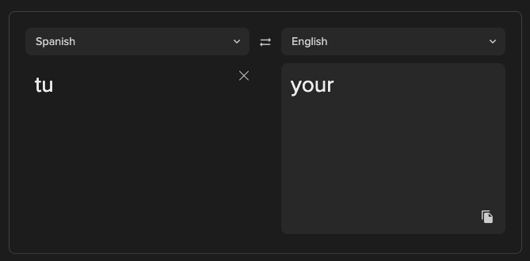

<p align="center">
  
  </p>

<p align="center">
    <i>Ubun[tu] tools that I'd like to run on any system.</i>
</p>


# tu
`tu` is an Ubuntu container that includes many of the tools I use on a daily
basis.  Docker provides the portability I need to keep my toolchain on my
M1-Mac and my x86_64 Macs as well as other linux based systems that I'd like
to keep strict provisioing on.

## What It Does
This package contains a launcher script that makes it easy to use debian/ubuntu
based cli tools on any docker ready host e.g.:

```bash
$ tu ls
$ ni .
$ ni ~/.my_hidden_file
$ ni ~/my_softlinked_file
$ ni ../../my_dir
$ ni ../../my_softlinked_dir
$ ni my_new_file
```

## Packages
This version of vim uses the following packages:

* [Ale](https://github.com/dense-analysis/ale/blob/master/README.md)
    * python
        * black formatting on save
        * flake8 linter
    * bash
        * shellcheck
    * remove_trailing_lines
* [CtrlP](https://github.com/kien/ctrlp.vim)
* [Solarized](https://ethanschoonover.com/solarized/)
* `ghmarkdown` syntax highlighting

# Installation
To install, issue the following command:

```bash
sudo bash -c "curl -s https://raw.githubusercontent.com/nckz/tu/master/tu > /usr/local/bin/tu && chmod a+x /usr/local/bin/tu"
```
