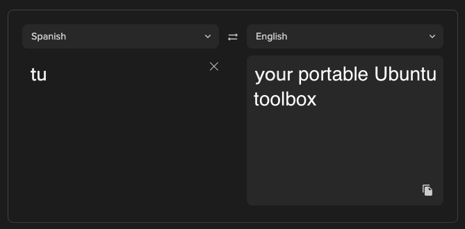

<p align="center">
  
  </p>

<p align="center">
    <i>Ubun[tu] tools that I'd like to run on any system.</i>
</p>


# tu
`tu` is an Ubuntu container that includes many of the tools I use on a daily
basis.  Docker provides the portability I need to keep my toolchain on my
M1-Mac and my x86_64 Macs as well as other linux based systems that I'd like
to keep strict provisioing on.

## What It Does
This package contains a launcher script that makes it easy to use debian/ubuntu
based cli tools on any docker ready host e.g.:

```bash
$ tu ls
$ tu apt-cache search python3-gnu
$ tu pandoc README.md
$ ARGS="-p 1313:1313 --hostname klaatu.local -it" tu hugo server --bind '0.0.0.0' --baseURL "http://$(hostname)/"
```

The launcher script mounts the CWD into a working path in the container; the
container is run with the calling user id so that the command can run within
the intended scope.

## Packages
This version has the following tools installed:

*    cbm
*    cloc
*    curl
*    git
*    htop
*    iperf
*    jq
*    less
*    net-tools
*    pandoc
*    python3
*    python3-pip
*    screen
*    snapd
*    speedtest-cli
*    texlive-xetex
*    vim
*    wget
*    yq


# Installation
To install, issue the following command:

```bash
sudo bash -c "curl -s https://raw.githubusercontent.com/nckz/tu/master/tu > /usr/local/bin/tu && chmod a+x /usr/local/bin/tu"
```
